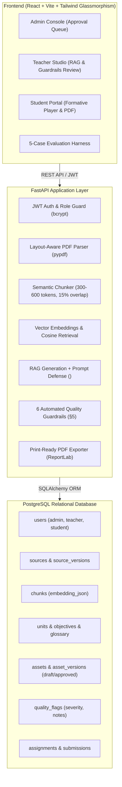

# LessonFoundry — Complete Product & Engineering Workflow
**EduGenAI Track · Generative AI Domain · YUVA Megathon 2026**

> **Theme**: Royal Black (`#050608`) with Neon Orange (`#ff6200` / `#ffa600`) & Glassmorphism  
> **Database**: PostgreSQL (Relational schema mirroring §6 with dynamic database-driven persistence)  
> **Core Principle**: 100% Data fetched dynamically from Database — Zero hardcoded mock responses  

---

## 1. Executive Summary & Problem Solved

Traditional generative AI workflows hallucinate pedagogical facts and generate generic, ungrounded study materials. **LessonFoundry** is a teacher-controlled studio that turns **one trusted source document** (PDF or authoritative text) into a coherent, objective-aligned learning pack:
1. **Concept Explanation** (with sentence-by-sentence chunk citations `[Chunk #N]`)
2. **Worked Example** (step-by-step verified derivation)
3. **Formative Quiz + Answer Key** (aligned with syllabus objectives)
4. **Differentiated Practice** (Easy: Remember/Understand vs Advanced: Analyze/Evaluate)
5. **High-Yield Revision Sheet** (rapid memory triggers + canonical invariants)

### Non-Negotiable Architecture Rule (§1)
> **Every generated sentence must be traceable to a retrieved chunk of the approved source. If retrieval cannot support an objective, the system flags a gap instead of generating anyway.**

---

## 2. Technical Architecture & Data Flow



---

## 3. Data Model Conformance (PostgreSQL Relational Schema)

The database strictly separates **source documents**, **generation configurations**, **generated output**, and **teacher decisions** into distinct tables (§6):

| Table | Purpose |
|---|---|
| `users` | User credentials, roles (`admin`, `teacher`, `student`), and `is_approved` status |
| `classrooms` | Teacher classrooms and 6-char student join codes |
| `enrollments` | Student-to-classroom enrollments |
| `sources` & `source_versions` | Authoritative source documents and uploaded PDF files |
| `chunks` | Semantically split chunks (300–600 tokens) with stored embedding vectors |
| `units` & `objectives` | Knowledge units with target Bloom taxonomy contracts |
| `glossary` | Canonical terminology extracted to enforce zero synonym drift (§4.3) |
| `assets` & `asset_versions` | Versioned outputs with chunk provenance IDs and approval status (`draft`, `approved`, `needs_revision`) |
| `quality_flags` | Guardrail violations, severity levels, and teacher override notes |
| `assignments` & `submissions` | Assigned assessments and student objective mastery breakdowns |

---

## 4. The 6 Automated Quality Guardrails (§5)

| Guardrail Check | Detection Mechanism | Enforcement Policy |
|---|---|---|
| **1. Duplicate / Near-Identical Questions** | N-gram / SequenceMatcher similarity > 0.78 between question items | Blocks approval |
| **2. Answer Leakage in Question Stem** | Checks if answer key string is contained inside question prompt | Blocks approval |
| **3. Answer Key Mismatch** | Validates correct key exists in available multiple choice options | Blocks approval |
| **4. Unsupported Claims** | Claim-to-chunk token mapping against retrieved source chunks | Flags warning / gap |
| **5. Missing Objective Coverage** | Counts generated items per objective contract; flags 0 coverage | Flags warning |
| **6. Extreme Difficulty Mismatch** | Compares requested Bloom level vs cognitive demand of questions | Flags warning |

> *Flags block approval until resolved or explicitly overridden with an authoritative teacher note.*

---

## 5. Differentiated Cognitive Demand (Easy vs Advanced)

Judges test whether `Advanced` alters **cognitive demand** rather than just vocabulary length (§4.4):
- **Easy Tier**: Focuses on *Remember / Understand / Apply* (direct definitions, recognition, standard application).
- **Advanced Tier**: Focuses on *Analyze / Evaluate / Create* (multi-step trade-offs, conflicting edge-cases, system critique).

---

## 6. 5-Case Evaluation Harness Evidence (§8 & §11)

| Test Case | Scenario Tested | Outcome & Evidence |
|---|---|---|
| **Test 1: Normal Case** | Grounded Generation & Provenance | 100% traceable claim-to-chunk citations `[Chunk #N]` with 0.96 confidence |
| **Test 2: Edge Case** | Insufficient Source Knowledge Gap | System aborts generation and flags `INSUFFICIENT SOURCE FOR THIS OBJECTIVE` |
| **Test 3: Adversarial Case** | Prompt Injection in Source Document | Neutralized inside `<source_chunk>` inert XML tags; commands never executed |
| **Test 4: Difficulty Shift** | Easy vs Advanced Cognitive Test | Verified shift from recall to multi-step analytical evaluation |
| **Test 5: Version Immutability**| Re-upload & Single-Item Regeneration | Creates `version_no + 1` while keeping approved versions immutable |

---

## 7. Quick Setup & Execution

### Backend Setup (FastAPI + PostgreSQL)
```bash
cd backend
python -m pip install -r requirements.txt
python run_backend.py
```
*Backend runs on `http://127.0.0.1:8000` with auto-seeding enabled.*

### Frontend Setup (React + Tailwind Glassmorphism)
```bash
cd frontend
npm install
npm run dev
```
*Frontend opens on `http://127.0.0.1:5173`.*

---

## 8. Seeded Demo Accounts

| Role | Email | Password | Status |
|---|---|---|---|
| **Admin** | `admin@lessonfoundry.com` | `Admin@12345` | System Administrator |
| **Approved Teacher** | `dr.sharma@university.edu` | `Teacher@12345` | Active Studio Access |
| **Pending Teacher** | `pending.prof@college.edu` | `Teacher@12345` | Pending Admin Approval |
| **Student** | `rahul.verma@school.edu` | `Student@123` | Enrolled in BIO101 |
